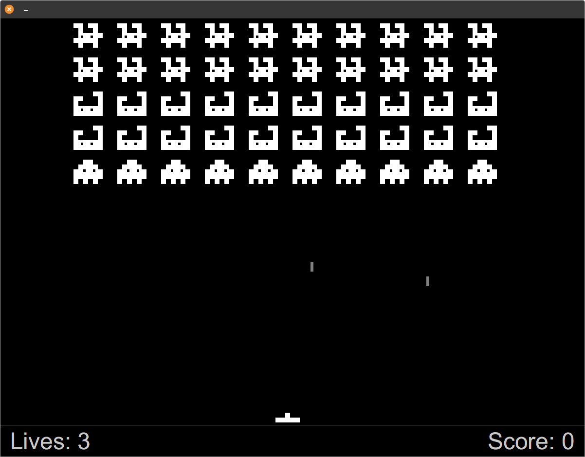

# CI401 - Introduction to Programming
## Coursework Submission - Invaders Java

This is my coursework submission for my introduction to programming course at the University of Brighton.

It is a simple invaders clone built using Java and the JavaFX library at openjfx.io.

This project was built without the use of any existing skeleton code and was modeled based on the 1978 space invaders game.

Due to constraints, I have ommited the use of the UFO and have altered the player bullet firing mechanic to use a timer rather than a single bullet on screen at a time.

Hope you have fun with the game! Controls are simply left and right for movement, space for firing and you can press 'P' at any time to show some nerd stats.